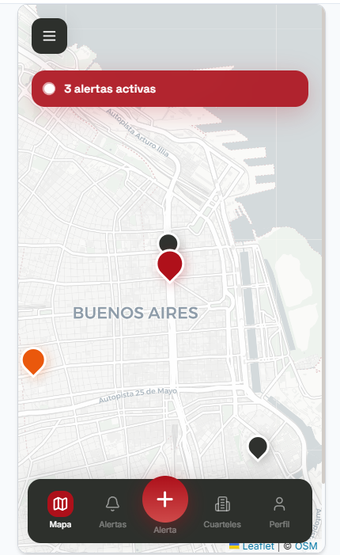
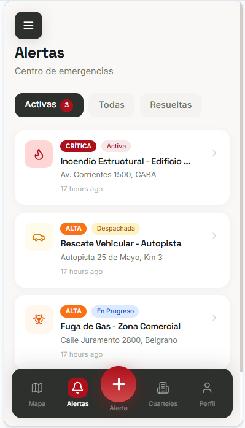
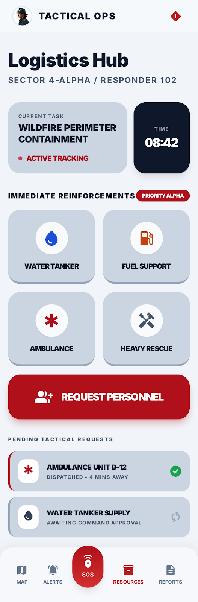
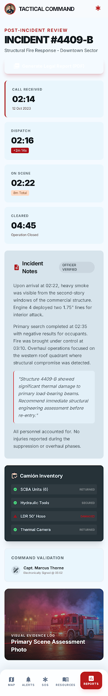
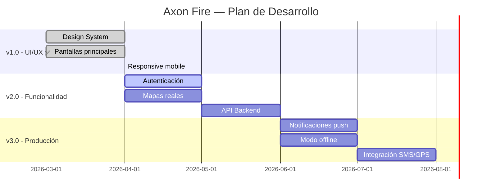

<p align="center">
  
</p>

<h1 align="center">AXON FIRE</h1>

<p align="center">
  <strong>Sistema de Gestión de Emergencias para Bomberos Voluntarios</strong>
</p>

<p align="center">
  
  
  
  
  
</p>

<p align="center">
  <em>Proyecto Final de Carrera — Universidad del Norte Santo Tomás de Aquino (UNSTA)</em>
</p>

---

## 📋 Índice

- [Acerca del Proyecto](#-acerca-del-proyecto)
- [Problemática](#-problemática)
- [Solución Propuesta](#-solución-propuesta)
- [Funcionalidades](#-funcionalidades)
- [Capturas de Pantalla](#-capturas-de-pantalla)
- [Arquitectura del Proyecto](#-arquitectura-del-proyecto)
- [Tecnologías Utilizadas](#-tecnologías-utilizadas)
- [Design System](#-design-system)
- [Requisitos Previos](#-requisitos-previos)
- [Instalación y Ejecución](#-instalación-y-ejecución)
- [Estructura del Proyecto](#-estructura-del-proyecto)
- [Componentes Principales](#-componentes-principales)
- [Pantallas de la Aplicación](#-pantallas-de-la-aplicación)
- [Roadmap](#-roadmap)
- [Autores](#-autores)
- [Licencia](#-licencia)

---

## 🔥 Acerca del Proyecto

**Axon Fire** es una aplicación móvil multiplataforma desarrollada como **Proyecto Final de la carrera de Ingeniería en Sistemas de Información** en la **Universidad del Norte Santo Tomás de Aquino (UNSTA)**, Tucumán, Argentina.

La aplicación está diseñada específicamente para **optimizar la operatividad de los cuarteles de bomberos voluntarios**, proporcionando herramientas digitales que modernizan la coordinación de emergencias, la gestión de recursos y la comunicación en tiempo real entre los efectivos.

---

## 🚨 Problemática

Los cuarteles de bomberos voluntarios en Argentina enfrentan desafíos operativos críticos:

- **Comunicación ineficiente**: Los sistemas de alerta actuales dependen de llamadas telefónicas individuales o grupos de WhatsApp, sin confirmación formal de asistencia.
- **Falta de trazabilidad**: No existe un registro digital en tiempo real de quién responde a una emergencia, dónde se encuentra y con qué recursos cuenta.
- **Zonas de baja conectividad**: Las áreas de montaña y rurales donde frecuentemente operan los bomberos carecen de cobertura de datos estable.
- **Reportes manuales**: La generación de informes post-incidente es un proceso manual, propenso a errores y demoras.
- **Gestión de inventario** desactualizada: El control de equipos, vehículos y suministros se realiza en planillas físicas.

---

## 💡 Solución Propuesta

Axon Fire propone una **plataforma móvil integral** que digitaliza el flujo operativo completo de un cuartel de bomberos:

| Módulo | Descripción |
|--------|-------------|
| **📱 Alertas en tiempo real** | Envío instantáneo de alertas a todos los efectivos con confirmación de asistencia |
| **🗺️ Mapa táctico** | Visualización georreferenciada del incidente, unidades en ruta y puntos de agua |
| **📦 Centro logístico** | Solicitud y seguimiento de refuerzos (cisternas, ambulancias, personal) |
| **📊 Reportes post-incidente** | Generación automática de informes con timeline, inventario y validación de comando |
| **🏢 Gestión de cuarteles** | Directorio de cuarteles con estado operativo, personal y vehículos disponibles |
| **📍 Geolocalización** | Rastreo en tiempo real de la posición de cada efectivo durante una emergencia |

---

## ✨ Funcionalidades

### Implementadas (v1.0)

- [x] **Dashboard de Alertas** — Lista priorizada de emergencias activas con badges de severidad (Crítica, Alta, Media, Baja)
- [x] **Mapa Táctico** — Visualización de frentes de fuego, puntos de agua y unidades respondiendo
- [x] **Creación de Alertas (SOS)** — Formulario para reportar nuevas emergencias con tipo, severidad y ubicación GPS
- [x] **Centro Logístico** — Panel de solicitud de refuerzos y seguimiento de recursos despachados
- [x] **Reportes Post-Incidente** — Timeline cronológica con notas, validación de comando e inventario
- [x] **Detalle de Alerta** — Vista expandida con stats en vivo, confirmación de asistencia y detalles tácticos
- [x] **Gestión de Cuarteles** — Directorio con estado operativo, personal asignado y vehículos
- [x] **Navegación Táctica** — Bottom Tab Navigator con FAB central de emergencia (SOS)
- [x] **Design System Completo** — Paleta de colores, tipografía, espaciado y componentes reutilizables
- [x] **Responsive Mobile-First** — Interfaz optimizada para dispositivos móviles (iOS & Android)
- [x] **Compatibilidad Web** — Funciona en navegadores vía `react-native-web`

### Próximas versiones

- [ ] Integración de mapas reales (Google Maps / MapView)
- [ ] Autenticación de usuarios (Login / Registro)
- [ ] API Backend (Node.js / Express)
- [ ] Persistencia offline-first (AsyncStorage / SQLite)
- [ ] Notificaciones push
- [ ] Geolocalización real con `expo-location`
- [ ] Integración SMS para zonas de baja conectividad
- [ ] Generación de PDF de reportes

---

## 📸 Capturas de Pantalla

<table>
  <tr>
    <td align="center"><strong>🗺️ Mapa Táctico</strong></td>
    <td align="center"><strong>🚨 Centro de Alertas</strong></td>
    <td align="center"><strong>📦 Centro Logístico</strong></td>
    <td align="center"><strong>📊 Reportes</strong></td>
  </tr>
  <tr>
    <td></td>
    <td></td>
    <td></td>
    <td></td>
  </tr>
</table>

---

## 🏗️ Arquitectura del Proyecto

```
┌─────────────────────────────────────────────────┐
│                   FRONTEND                       │
│            React Native + Expo                   │
│                                                  │
│  ┌─────────┐  ┌──────────┐  ┌───────────────┐   │
│  │ Screens │  │Components│  │ Theme System  │   │
│  │         │  │          │  │               │   │
│  │ • Map   │  │• Tactical│  │ • Colors      │   │
│  │ • Alerts│  │  Card    │  │ • Typography  │   │
│  │ • SOS   │  │• Status  │  │ • Spacing     │   │
│  │ • Logs  │  │  Badge   │  │ • Radius      │   │
│  │ • Report│  │• Primary │  │               │   │
│  │ • HQ    │  │  Button  │  │               │   │
│  └────┬────┘  └────┬─────┘  └───────┬───────┘   │
│       │            │                │            │
│  ┌────┴────────────┴────────────────┴───────┐    │
│  │          Navigation Layer                 │    │
│  │   Bottom Tab Navigator + FAB Central     │    │
│  └──────────────────────────────────────────┘    │
│                                                  │
│  ┌──────────────────────────────────────────┐    │
│  │         Platform Abstraction              │    │
│  │   iOS  ←→  Android  ←→  Web              │    │
│  └──────────────────────────────────────────┘    │
└─────────────────────────────────────────────────┘
```

---

## 🛠️ Tecnologías Utilizadas

### Core

| Tecnología | Versión | Propósito |
|------------|---------|-----------|
| **React Native** | 0.81.5 | Framework multiplataforma para desarrollo móvil |
| **React** | 19.1.0 | Librería de interfaces de usuario |
| **Expo** | 54.0.33 | Plataforma de desarrollo y distribución |

### Navegación

| Tecnología | Versión | Propósito |
|------------|---------|-----------|
| **@react-navigation/native** | 7.2.2 | Sistema de navegación principal |
| **@react-navigation/bottom-tabs** | 7.15.9 | Navegación por pestañas inferior |
| **react-native-screens** | 4.24.0 | Optimización de pantallas nativas |

### UI & Estilos

| Tecnología | Versión | Propósito |
|------------|---------|-----------|
| **@expo/vector-icons** | 15.1.1 | Iconografía (MaterialCommunityIcons, MaterialIcons) |
| **expo-linear-gradient** | 55.0.13 | Gradientes para botones y fondos |
| **react-native-safe-area-context** | 5.7.0 | Manejo de safe areas (notch, barra de estado) |

### Funcionalidades

| Tecnología | Versión | Propósito |
|------------|---------|-----------|
| **expo-location** | 55.1.8 | Geolocalización GPS |
| **react-native-maps** | 1.27.2 | Visualización de mapas nativos |
| **react-native-web** | 0.21.0 | Compatibilidad con navegadores web |

---

## 🎨 Design System

Axon Fire implementa un design system propio denominado **"Tactical Monolith"**, diseñado para entornos de alta presión donde la **claridad es un requisito, no una característica**.

### Principios de Diseño

| Principio | Descripción |
|-----------|-------------|
| **No-Line Rule** | Prohibido el uso de bordes de 1px. La separación se logra mediante capas tonales |
| **Tonal Layering** | Profundidad visual a través de cambios sutiles de color de fondo |
| **Glassmorphism** | Elementos flotantes con transparencia y desenfoque |
| **Ready-State** | Paleta de colores que comunica estado de alerta constante |

### Paleta de Colores

```
┌──────────────────────────────────────────────────────┐
│  PRIMARY (Emergency Red)                              │
│  ██████  #af101a  →  ██████  #d32f2f                 │
│                                                       │
│  SURFACE HIERARCHY                                    │
│  ░░░░░░  #ffffff  surfaceContainerLowest              │
│  ▒▒▒▒▒▒  #e9f6fd  surfaceContainerLow                │
│  ▓▓▓▓▓▓  #ddeaf2  surfaceContainerHigh               │
│  ██████  #263238  inverseSurface                      │
│                                                       │
│  SEMANTIC ACCENTS                                     │
│  ██████  #388e3c  success (Operativo)                 │
│  ██████  #1976d2  alertBlue (Información)             │
│  ██████  #F57C00  warningOrange (Precaución)          │
└──────────────────────────────────────────────────────┘
```

### Tipografía

- **Font Family**: Inter (sistema/nativa)
- **Escala**: Display → Headline → Title → Body → Label
- **Peso**: `Medium` y `Semi-Bold` prioritarios para legibilidad en condiciones adversas

### Componentes Reutilizables

| Componente | Descripción |
|------------|-------------|
| `TacticalCard` | Contenedor principal sin bordes, con capas tonales y sombras ambientales |
| `StatusBadge` | Badge de criticidad (Crítica, Alta, Media, Baja, Activa, Despachada) |
| `PrimaryButton` | Botón con gradiente rojo de emergencia y micro-animaciones |

---

## 📋 Requisitos Previos

Antes de ejecutar el proyecto, asegúrate de tener instalado:

- **Node.js** v18.0 o superior → [Descargar](https://nodejs.org/)
- **npm** v9.0 o superior (incluido con Node.js)
- **Expo CLI** (se instala automáticamente con `npx`)
- **Git** → [Descargar](https://git-scm.com/)

### Para desarrollo móvil (opcional)

- **Expo Go** app instalada en tu dispositivo iOS/Android
- **Android Studio** (para emulador Android)
- **Xcode** (para simulador iOS — solo macOS)

---

## 🚀 Instalación y Ejecución

### 1. Clonar el repositorio

```bash
git clone https://github.com/GonzaloMartinezz/App-AxonFire-Frontend.git
cd App-AxonFire-Frontend/AxonFire
```

### 2. Instalar dependencias

```bash
npm install
```

### 3. Ejecutar la aplicación

```bash
# Iniciar en modo desarrollo (todas las plataformas)
npx expo start

# Solo Web (navegador)
npx expo start --web

# Solo Android
npx expo start --android

# Solo iOS (requiere macOS + Xcode)
npx expo start --ios
```

### 4. Abrir en el dispositivo

- **Web**: Abre `http://localhost:8081` en tu navegador
- **Mobile**: Escanea el código QR con la app **Expo Go**
- **Emulador**: Presiona `a` (Android) o `i` (iOS) en la terminal

---

## 📁 Estructura del Proyecto

```
App-AxonFire-Frontend/
│
├── AxonFire/                          # Aplicación React Native
│   ├── App.js                         # Entry point con SafeAreaProvider
│   ├── index.js                       # Registro de la app
│   ├── app.json                       # Configuración de Expo
│   ├── package.json                   # Dependencias y scripts
│   │
│   ├── src/
│   │   ├── components/                # Componentes reutilizables
│   │   │   ├── TacticalCard.js        #   └─ Contenedor tipo tarjeta táctica
│   │   │   ├── StatusBadge.js         #   └─ Badge de criticidad/estado
│   │   │   └── PrimaryButton.js       #   └─ Botón principal con gradiente
│   │   │
│   │   ├── navigation/                # Sistema de navegación
│   │   │   └── AppNavigator.js        #   └─ Bottom Tabs + FAB central SOS
│   │   │
│   │   ├── screens/                   # Pantallas de la aplicación
│   │   │   ├── MapScreen.js           #   └─ Mapa táctico de incidentes
│   │   │   ├── AlertsScreen.js        #   └─ Dashboard de alertas activas
│   │   │   ├── NewAlertScreen.js       #   └─ Formulario de nueva emergencia
│   │   │   ├── AlertDetailScreen.js   #   └─ Detalle y confirmación de alerta
│   │   │   ├── ResourcesScreen.js     #   └─ Centro logístico de recursos
│   │   │   ├── ReportsScreen.js       #   └─ Reporte post-incidente
│   │   │   └── CuartelesScreen.js     #   └─ Gestión de cuarteles
│   │   │
│   │   └── theme/                     # Design System (tokens)
│   │       ├── index.js               #   └─ Barrel exports
│   │       ├── colors.js              #   └─ Paleta de colores completa
│   │       └── typography.js          #   └─ Tipografía, espaciado y radios
│   │
│   └── assets/                        # Recursos estáticos (imágenes, fuentes)
│
└── Proyecto-Mockup-AxonFire/          # Mockups y diseño visual
    ├── command_core_tactical/
    │   └── DESIGN.md                  # Especificación del Design System
    ├── active_alerts_dashboard/       # Mockup del dashboard
    ├── incident_map_logistics/        # Mockup del mapa táctico
    ├── logistics_hub_tactical_grey/   # Mockup del centro logístico
    └── post_incident_report_summary/  # Mockup de reportes
```

---

## 📱 Pantallas de la Aplicación

### 🗺️ MapScreen — Mapa Táctico
Centro de comando visual que muestra la situación táctica en tiempo real:
- Vista aérea del área de operaciones con gradiente topográfico
- Marcadores de **frentes de fuego**, **puntos de agua** y **respondedores**
- Perímetro de seguridad con líneas dashed
- Card de estado de misión con conteo de unidades activas
- Controles de mapa (capas, ubicación, zoom)

### 🚨 AlertsScreen — Centro de Emergencias
Dashboard principal de alertas activas con sistema de filtrado:
- Filtros por estado: Activas, Todas, Resueltas
- Tarjetas de alerta con badge de severidad, dirección y unidades asignadas
- Botón de acción rápida "RESPONDER"
- Indicador de unidades cercanas disponibles

### ➕ NewAlertScreen — Reporte de Emergencia
Formulario para crear nuevas alertas de emergencia:
- Selector de tipo (Incendio, Rescate, Materiales Peligrosos, Médica, Estructural)
- Nivel de severidad (Crítica, Alta, Media, Baja)
- Ubicación automática por GPS con coordenadas
- Campos para título y descripción detallada

### 📦 ResourcesScreen — Centro Logístico
Panel de gestión de recursos y refuerzos en campo:
- Tarea actual asignada con tracking de tiempo
- Grilla de solicitud rápida de refuerzos (Cisterna, Combustible, Ambulancia, Rescate)
- Botón de solicitud de personal adicional
- Lista de solicitudes pendientes con estado de despacho

### 📊 ReportsScreen — Reporte Post-Incidente
Resumen cronológico del incidente para documentación oficial:
- Timeline vertical con tiempos de respuesta y deltas
- Notas del incidente con bloque de cita oficial
- Validación de comando con firma digital
- Inventario del camión con estado de equipos (Devuelto / Dañado)
- Generación de PDF para legajo oficial

### 🔍 AlertDetailScreen — Detalle de Alerta
Vista expandida de una alerta individual:
- Hero card con ubicación georreferenciada
- Estadísticas en vivo (tiempo transcurrido, respondiendo)
- Botón de confirmación / rechazo de asistencia
- Detalles tácticos del incidente

### 🏢 CuartelesScreen — Gestión de Cuarteles
Directorio de cuarteles con información operativa:
- Estados operativos con indicadores visuales
- Personal asignado y vehículos disponibles
- Acciones rápidas (ver en mapa, llamar)

---

## 🗺️ Roadmap



---

## 👨‍💻 Autores

| Rol | Nombre | Contacto |
|-----|--------|----------|
| **Desarrollador Frontend** | Gonzalo Martínez | [GitHub](https://github.com/GonzaloMartinezz) |

> **Proyecto Final de Carrera** — Ingeniería en Sistemas de Información
> **Institución**: Universidad del Norte Santo Tomás de Aquino (UNSTA)
> **Ubicación**: Tucumán, Argentina
> **Año**: 2026

---

## 📄 Licencia

Este proyecto está bajo la **Licencia MIT**. Consulta el archivo [LICENSE](LICENSE) para más información.

---

<p align="center">
  <strong>🔥 AXON FIRE — Cuando cada segundo cuenta 🔥</strong>
</p>

<p align="center">
  <sub>Hecho con ❤️ para los Bomberos Voluntarios de Argentina</sub>
</p>
